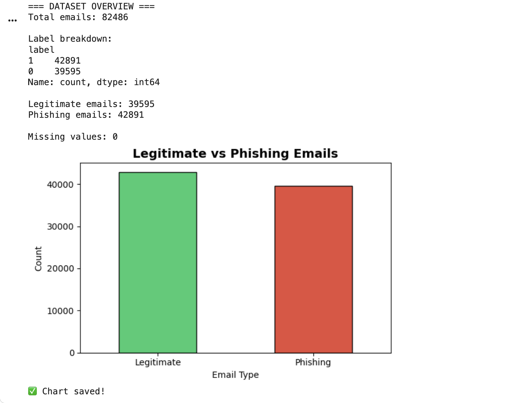
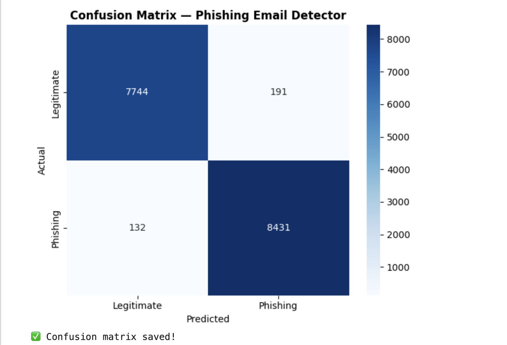
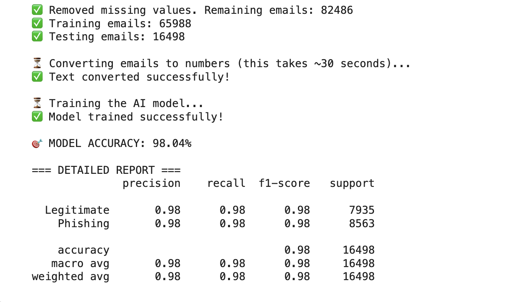

# 🛡️ Phishing Email Analyzer

A machine learning project that detects phishing emails with **98% accuracy** using Python, TF-IDF, and Logistic Regression — trained on 82,000+ real emails.

## 📊 Results
- ✅ Model Accuracy: **98.04%**
- ✅ Trained on: **65,988 emails**
- ✅ Tested on: **16,498 emails**
- ✅ Precision & Recall: **0.98 for both classes**

## 📈 Visualizations

### Email Distribution

### Model Performance — Confusion Matrix

### Accuracy Report

## 🔍 How It Works
1. Loads 82,000+ real phishing and legitimate emails
2. Cleans and preprocesses the text data
3. Converts email text to numerical features using TF-IDF Vectorization
4. Trains a Logistic Regression classifier
5. Evaluates performance using accuracy, precision, recall and F1-score
6. Detects new emails in real time with confidence scores

## 🧪 Live Detection Example
